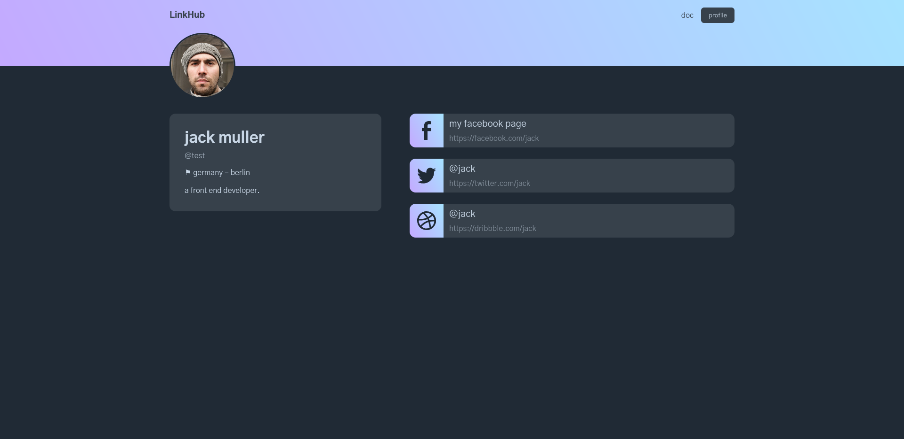

<h1 align="center">
  Linkhub
</h1>

## 👾 About

a simple full-stack, web application, developed with Nextjs and MongoDb, authorization has been done with Next-auth, by google as the authentication provider. users pages after generation, scored 95 on [web.dev](https://web.dev/measure/), lighthouse test.

#### Libraries:
- react
- nextjs
- next-auth
- mongodb
- framer-motion

## 🚀 Cloning guide

1.  **Clone the code**

    Use git to clone the website code.

    ```shell
        git clone https://github.com/amir4rab/linkhub
        cd linkhub
    ```

2.  **Add environment variables**

    start a firebase application and setup a shopify account.
    '.env.local' file should incloude the following values:
    ```javascript
        GOOGLE_CLIENT_ID= 'your google client id'
        GOOGLE_CLIENT_SECRET= 'your google client secret'

        MONGODB_URL= 'your mongodb uri'

        NEXTAUTH_URL= `http://localhost:3000`
    ```

3.  **Installing the dependencies**
    then write the following command:
    ```shell
      npm install
    ```

4. **Start developing**
    Everything is almost ready, just type the following command:
    ```shell
      npm run dev
    ```
    Your site is now running at http://localhost:3000!
